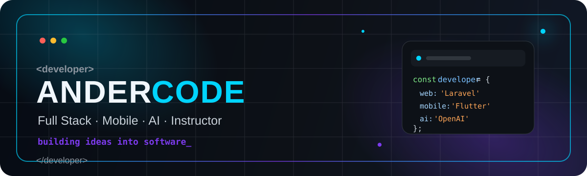

<p align="center">
  
</p>

<p align="center">
  <a href="https://anderson-bastidas.com/"></a>
  <a href="https://anderson-bastidas.com/cursos/udemy"></a>
  <a href="https://anderson-bastidas.com/public/rutas-de-aprendizaje"></a>
  
</p>

<p align="center">
  <a href="https://www.youtube.com/AnderCode"></a>
  <a href="https://www.instagram.com/ander_code"></a>
  <a href="https://web.facebook.com/Ander.Codex"></a>
  <a href="https://www.linkedin.com/company/andercode/"></a>
  <a href="https://vm.tiktok.com/ZMeDnNmnn/"></a>
  <a href="https://www.udemy.com/user/anderson-bastidas/"></a>
</p>

## 👨‍💻 Hola, soy AnderCode

Soy **Anderson Bastidas**, desarrollador Full Stack, instructor y creador de **AnderCode**. Me enfoco en enseñar programación construyendo proyectos reales y en crear productos donde convergen desarrollo web, aplicaciones móviles, automatización e inteligencia artificial.

> **Aprende. Construye. Mantente al día.**

- 🚀 Desarrollo plataformas web, APIs y productos Full Stack.
- 📱 Construyo aplicaciones móviles con **Flutter**.
- 🤖 Trabajo con **IA, agentes, automatización, Ollama y OpenAI**.
- 🎓 Creo cursos prácticos, rutas de aprendizaje y proyectos para estudiantes.
- 🧩 Desarrollo herramientas gratuitas y productos digitales dentro del ecosistema AnderCode.
- 🇵🇪 Construyendo desde Perú para una comunidad de habla hispana.

<p align="center">
  
  
  
</p>

---

## 🌐 Ecosistema AnderCode

AnderCode no es solo un repositorio o un catálogo de cursos. Es un ecosistema de aprendizaje, herramientas, contenido y proyectos reales.

<table>
<tr>
<td width="50%">

### 🌎 Portal AnderCode
Cursos, herramientas para desarrolladores, noticias tech, comunidad y recursos.

[**Visitar anderson-bastidas.com →**](https://anderson-bastidas.com/)

</td>
<td width="50%">

### 🧭 Rutas de aprendizaje
Caminos organizados por tecnología para avanzar desde fundamentos hasta proyectos.

[**Explorar rutas →**](https://anderson-bastidas.com/public/rutas-de-aprendizaje)

</td>
</tr>
<tr>
<td width="50%">

### 🎓 Cursos
Formación práctica en Laravel, Flutter, Python, Node.js, NestJS, React, Angular, IA y más.

[**Ver cursos en AnderCode →**](https://anderson-bastidas.com/cursos/udemy)

</td>
<td width="50%">

### ▶️ Videos AnderCode
Tutoriales, demostraciones, directos y contenido para la comunidad.

[**Ver videos →**](https://anderson-bastidas.com/videos)

</td>
</tr>
<tr>
<td width="50%">

### 🛠️ Herramientas gratuitas
Generadores, utilidades y proyectos online creados para resolver tareas concretas.

[**Explorar herramientas →**](https://anderson-bastidas.com/)

</td>
<td width="50%">

### 🏅 Certificación AnderCode
Los alumnos pueden presentar sus proyectos y evidencias para solicitar una revisión y certificado.

[**Conocer AnderCode →**](https://anderson-bastidas.com/about)

</td>
</tr>
</table>

## 🔥 Cursos destacados

<table>
<tr>
<td width="33%">

### 📱 Flutter + Firebase
**App Offline First desde Cero**

GPS, fotografías, persistencia local, sincronización y Firebase con un proyecto real.

[**Ver curso →**](https://anderson-bastidas.com/cursos/udemy/flutter-firebase-app-offline-first-desde-cero)

</td>
<td width="33%">

### 🤖 WhatsApp + IA
**NestJS, Ollama y Meta Cloud API**

Backend profesional con MySQL, Drizzle ORM, Tool Calling, campañas y atención humana.

[**Ver curso →**](https://anderson-bastidas.com/cursos/udemy/whatsapp-chatbot-con-nestjs-ollama-y-meta-cloud-api)

</td>
<td width="33%">

### ⚛️ Next.js + React
**Apps con APIs Públicas**

React, TypeScript, App Router, Pokémon, The Simpsons y Yu-Gi-Oh! con APIs REST.

[**Ver curso →**](https://anderson-bastidas.com/cursos/udemy/nextjs-y-react-crea-apps-con-apis-publicas-desde-cero)

</td>
</tr>
</table>

<p align="center">
  <a href="https://www.udemy.com/user/anderson-bastidas/">
    
  </a>
</p>

---

## 🧰 Tech Stack

### Backend & APIs
<p>
  
  
  
  
  
</p>

### Frontend & Mobile
<p>
  
  
  
  
  
</p>

### Data, Cloud & AI
<p>
  
  
  
  
  
  
</p>

---

## 🚀 Repositorios AnderCode & proyectos de cursos

Estos repositorios públicos representan parte del contenido práctico, ejemplos y proyectos que he creado alrededor de AnderCode.

<table>
<tr>
<td width="50%">

### 🎵 Spotify Clone with Flutter
Proyecto móvil inspirado en Spotify para trabajar UI, navegación y experiencia de reproducción.

[**GitHub →**](https://github.com/Anders87x/Spotify-Clone-With-Flutter)

</td>
<td width="50%">

### 🐾 Flutter AnderCode Pokédex
Proyecto Flutter enfocado en consumo de API y construcción de interfaces móviles.

[**GitHub →**](https://github.com/Anders87x/flutter_andercode_pokedex)

</td>
</tr>
<tr>
<td width="50%">

### ⚛️ React Pokédex
Proyecto práctico con React para consumir APIs y trabajar componentes.

[**GitHub →**](https://github.com/Anders87x/curso-react-pokedex)

</td>
<td width="50%">

### 🤖 Meta API + Python
Proyecto de curso orientado a integración de Python con APIs de Meta.

[**GitHub →**](https://github.com/Anders87x/CURSO_APIMETAPYTHON)

</td>
</tr>
<tr>
<td width="50%">

### 🧰 Tutorial HelpDesk
Proyecto público de AnderCode orientado a un sistema de mesa de ayuda.

[**GitHub →**](https://github.com/Anders87x/Tutorial_HelpDesk)

</td>
<td width="50%">

### 🅰️ Angular + APIs Públicas
Proyecto para practicar Angular consumiendo servicios y APIs reales.

[**GitHub →**](https://github.com/Anders87x/angular-apispublicas)

</td>
</tr>
<tr>
<td width="50%">

### 🔳 QR Factory
Utilidad y proyecto práctico relacionado con generación y trabajo con códigos QR.

[**GitHub →**](https://github.com/Anders87x/qr_factory)

</td>
<td width="50%">

### 🛒 Compras & Ventas Laravel
Proyecto web con Laravel orientado a lógica de negocio y operaciones de compra/venta.

[**GitHub →**](https://github.com/Anders87x/SistemaComprasVentas_Laravel)

</td>
</tr>
</table>

> 🔒 Algunos proyectos actuales de producción y materiales premium se mantienen privados mientras forman parte de plataformas activas o cursos.

## 🧪 Actualmente construyendo

```text
AnderCode Platform   → Cursos · Rutas · Herramientas · Noticias · Certificación
Web & APIs           → Laravel · NestJS · Node.js · Swagger
Mobile               → Flutter · Firebase · Offline First
AI & Automation      → Ollama · OpenAI · Tool Calling · Agentes
Education            → Cursos prácticos · Proyectos reales · Comunidad
```

---

## 📊 GitHub

<p align="center">
  
  
</p>

### 🐍 Contribution Snake

<p align="center">
  <picture>
    <source media="(prefers-color-scheme: dark)" srcset="https://raw.githubusercontent.com/Anders87x/Anders87x/output/github-contribution-grid-snake-dark.svg" />
    <source media="(prefers-color-scheme: light)" srcset="https://raw.githubusercontent.com/Anders87x/Anders87x/output/github-contribution-grid-snake.svg" />
    
  </picture>
</p>

---

## 🤝 Comunidad & redes

<p align="center">
  <a href="https://www.youtube.com/AnderCode"></a>
  <a href="https://www.instagram.com/ander_code"></a>
  <a href="https://www.linkedin.com/company/andercode/"></a>
  <a href="https://web.facebook.com/Ander.Codex"></a>
  <a href="https://vm.tiktok.com/ZMeDnNmnn/"></a>
</p>

<p align="center">
  <a href="https://linktr.ee/andercode"><b>Todos mis enlaces</b></a>
  &nbsp;•&nbsp;
  <a href="https://anderson-bastidas.com/contacto"><b>Contacto</b></a>
  &nbsp;•&nbsp;
  <a href="https://anderson-bastidas.com/"><b>AnderCode</b></a>
</p>

<p align="center">
  <sub>💙 Aprende · Construye · Comparte · Sigue creciendo</sub><br/>
  <sub>AnderCode · <a href="https://anderson-bastidas.com/">anderson-bastidas.com</a></sub>
</p>
